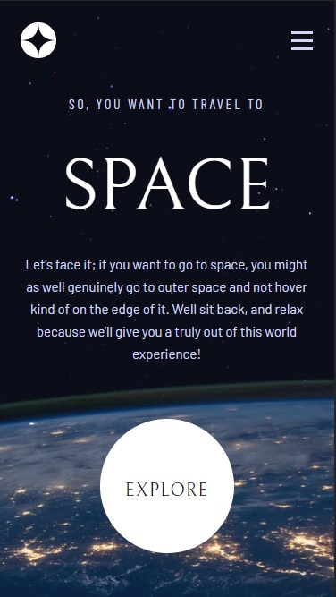
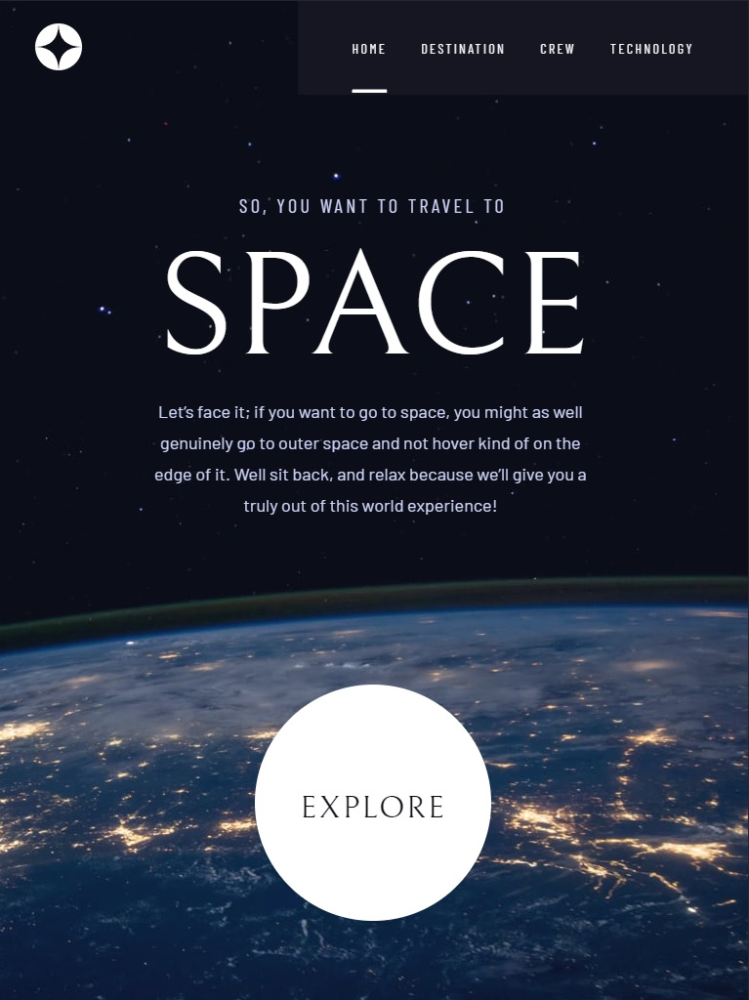
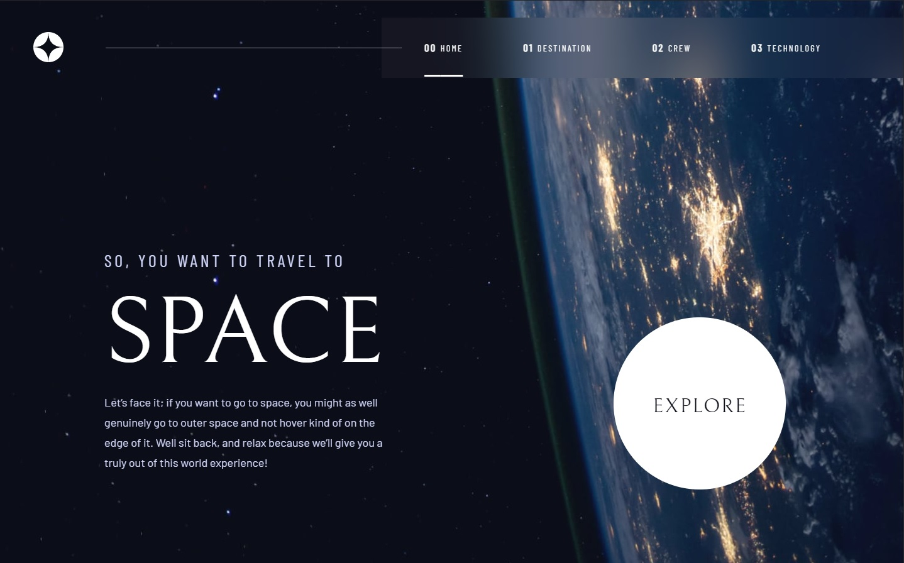

# Frontend Mentor - Space tourism website solution

This is a solution to the [Space tourism website challenge on Frontend Mentor](https://www.frontendmentor.io/challenges/space-tourism-multipage-website-gRWj1URZ3). Frontend Mentor challenges help you improve your coding skills by building realistic projects. 

## Table of contents

- [Overview](#overview)
  - [The challenge](#the-challenge)
  - [Screenshot](#screenshot)
  - [Links](#links)
- [My process](#my-process)
  - [Built with](#built-with)
  - [Continued development](#continued-development)
- [Author](#author)

## Overview

### The challenge

Users should be able to:

- View the optimal layout for each of the website's pages depending on their device's screen size
- See hover states for all interactive elements on the page
- View each page and be able to toggle between the tabs to see new information

### Screenshot

### Links

- Solution URL: [My Solution](https://www.frontendmentor.io/solutions/solution-space-tourism-9yuHGZTnR-)
- Live Site URL: [Netlify](https://jovial-panda-92b065.netlify.app/)

## My process

### Built with

- Semantic HTML5 markup
- CSS custom properties
- Flexbox
- CSS Grid
- Sass
- Mobile-first workflow
- [React](https://reactjs.org/) - JS library
- React Router

### Continued development

Moving forward, I'm going to rethink the way that I do styling. I am confident that this could have been accomplished with significantly less CSS. Looking back on it, I feel I could have made a reusable component for the pages outside of the homepage as well. I'm going to play around a lot more with CSS Grid and also give Tailwind a proper run.

## Author

- GitHub - [CodyyLee](https://github.com/CodyyLee)
- Frontend Mentor - [@CodyyLee](https://www.frontendmentor.io/profile/CodyyLee)
